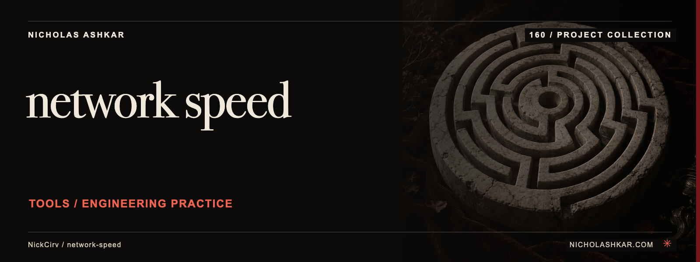

# network-speed

Measure a terminal session’s TCP connection latency and approximate download/upload throughput.

The default run combines three TCP targets with an HTTP download and upload test. JSON and one-line output make the results easier to inspect or record.


<a id="install"></a>

## Quickstart

Package runtime requirement: Node.js `>=20`. Git is needed to obtain this pinned source checkout.

```bash
git clone https://github.com/NickCirv/network-speed.git
cd network-speed
git checkout 3705ebe111e41c73d746507e00cba68ac8c8dd2e
node index.js --help
```

This source-derived example has not been executed in this review. Help does not start a network test. The following ping example makes outbound TCP connections.


<a id="what-it-does"></a>

## Usage

```bash
node index.js --ping --json
node index.js --download --size 10
node index.js --upload --duration 10
node index.js --simple
```

`--server <url>` changes the HTTP test base. `--isp` requests ISP/location data from `http://ip-api.com`; it is optional.

[Command reference](docs/REFERENCE.md) covers arguments, modes and output controls.

## Behavior and limits

Latency is TCP connection timing, not ICMP ping. Default download traffic goes to Cloudflare’s speed endpoint with an httpbin fallback; uploads use httpbin. Results depend on those services and the network path, not just the access link. The upload loop can overrun its requested duration while awaiting a request. ISP lookup uses unencrypted HTTP.

## Development

Declared package scripts:

| Script | Command |
| --- | --- |
| `test` | `node --test` |

The smoke test syntax-checks the entrypoint; it does not exercise CLI behavior or integrations.

## Research

[Source review and claim ledger](docs/RESEARCH.md) records revision `3705ebe111e4`, inspected files and verification gaps.

## License and attribution

Protected license and attribution files remain unchanged: [LICENSE](https://github.com/NickCirv/network-speed/blob/3705ebe111e41c73d746507e00cba68ac8c8dd2e/LICENSE).

[Artwork credits](assets/nicholas-ashkar/CREDITS.md) · [Nicholas Ashkar — consulting](https://nicholashkar.com/#oxblood-contact)
